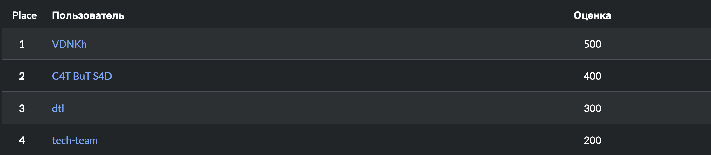

# CTFCUP-25 final

### Description
Every participant team gained access to 3 machines with user and root flags. Access to the 4th machine appeared after solving the basic three.

### Statistics 
- 4 teams
- 800 total possible points
- 8 challenges
- 1th generator Power on has the most solves with 4 solves

##### Developers
- devopn
- burdi
- rgudz
- atoroe
- shadowp1e